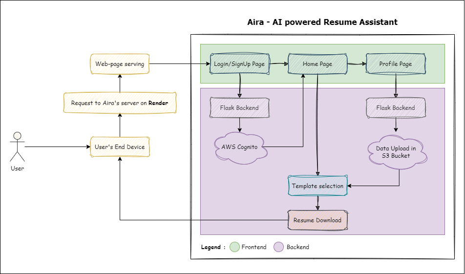
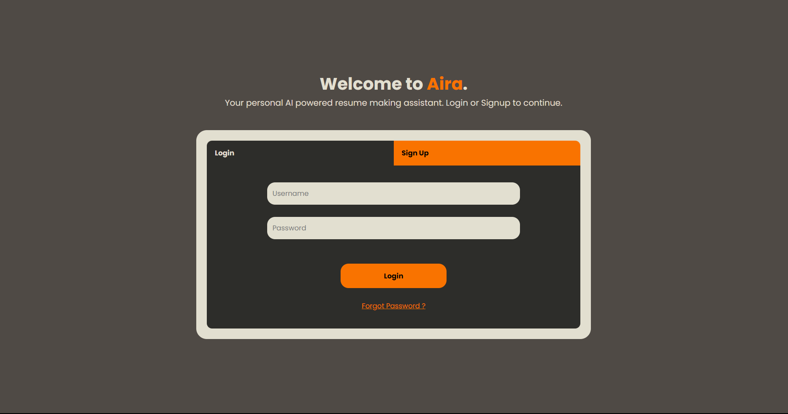
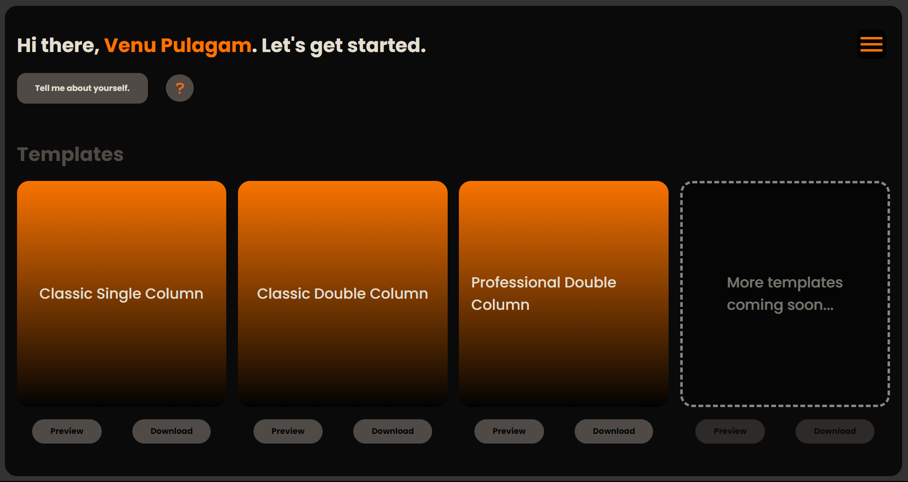
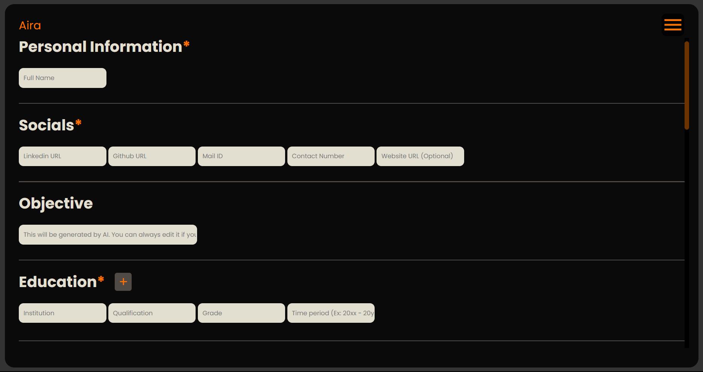
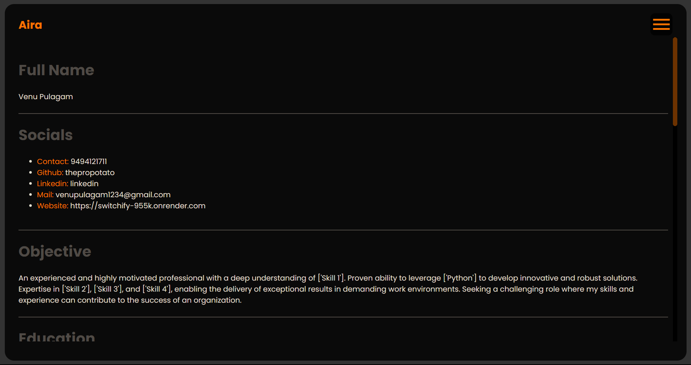
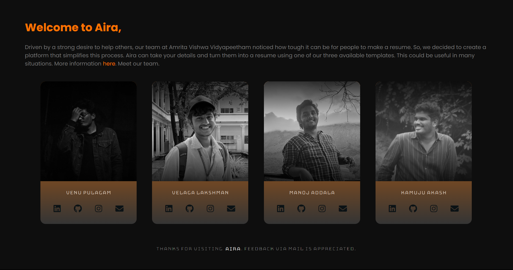

# What is Aira ? 

**Aira** is an AI powered resume making assistant that can take the data (information required for the professional advancements of a person), modify the latex of the available resume templates. The usage of AI (Gemini, created by Google) in Aira comes handy when users have to write the Objective for their resume.

Aira not only writes the Objective based on a user’s profile, but also clearly explains the projects (based on the 1-2 line brief given by the user). It also takes into account, the tech stack used.

The time to fill the information form might vary among users. But for that single investment of time, they get 3 (as of now) formats of resume.

Website : The website is now live at <a href=https://airaforyou.onrender.com>https://airaforyou.onrender.com</a>  

# Aira - Methodology

1. Users will be required to Login/Signup for the service.
2. On successful login, users will be redirected to **Home page** of Aira.
3. The home page contains the available templates. A user should fill the details in the **Update Profile** (can be accessed using the button in the home page) to expect resumes tailored for him.
4. Once the information is entered in the Profile page, The data will be saved on the cloud.
5. The updated data can be checked in the **Current Profile** page.
6. That is it, you can simply go the home page, choose your favourite template, click **'Download'** to make it yours.

The details of what happens behind the screens is clearly discussed in the [Behind the screens](#back-end) section of the article.
  

# Aira - Website

The website is built purely using Python, HTML, CSS and a bit of Javascript. The website is ***not built responsive*** (adapting to screens). So, **viewing from a Laptop/Computer (Landscape mode) is suggested**.
 

    Each line of code behind the website is written from scratch.
 

# Landing (Login) page

The login page allows users (first time users) to signup, and users who have already signed up can simply login.

### <li> Sign Up process :
1. Choose a username
2. Enter your mail ID.
3. Enter password, confirm password.
4. Click **Sign Up** to get a verification code.
5. Enter the verification code to complete the signup process.
6. Login with the credentials to continue.

*Forgot password* option allows you to reset your password.
  

# Home page

This page contains 3 templates (as of now). 
1. Classic Single Column
2. Classic Double Column
3. Professional Double Column

Users can choose any one of these templates and
1. Hit **Preview** to open the raw *Overleaf* template.
2. Hit **Download** to open the tailored/customized *Overleaf* template.
3. For downloading the customized template, one should have the data already stored in the *Current Profile* page. If not, he/she can add data using the **Tell me about yourself** button, that redirects to the *Update Profile* page.
4. Hovering on the *question mark* icon will let the users know about the 3rd point.
  

# Update Profile page

This section/page takes inputs of professional information from the user. Hitting on the **Save Information** button will upload the data on the cloud.
  

# Current Profile page

This is where the uploaded data can be checked for knowing what data you can expect in your resume. Everything that is present in this page, will show up in your resume.
  

# About page

This section of the website talks about the creators and our primary aim of Aira. You can always get in touch with us using the creator cards.
  

<h1 id="back-end">Behind the screens</h1>

The backend work flow of each section is discussed clearly below.
<ul>

## Sign Up process :
1. When a user signs up, he/she (using username, email, password) will be added to *user pool* in AWS console.
2. If the user creation in Cognito is succesful, the process will continue to allot aN S3 bucket to the user. The name of the given bucket will be his/her username itself.
3. In case of any error, the account (if its created) will be deleted to avoid discrepencies in the future.
4. Authentication (While logging in) and Verfication code validation is done using cognito's very own APIs.

## Profile Updation process :
1. When a user updates his/her profile, the data will be uploaded as a JSON file in the S3 bucket. The name of the JSON file will be *your_username.json*
2. Immediately after the json file is uploaded, python functions to change the latex codes of the 3 templates will be called. These functions take the json data and modify the latex code to make it customised for each user.
3. Latex (.tex) files of all the updated (customised) resume templates will be stored in the S3 bucket given to the user.
4. So there is need to write your data into each template only when you click **Download**. It happens when you save your information itself, that too for all the 3 templates at once. So no waste of time.

    ## Usage of AI :
    1. The Objective/Summary section of the resume will be written by an AI (unless you provide an objective yourself).
    2. Also, the project descriptions will be elaborated and professionally rephrased using the AI. 
    3. The AI we have used here is **Gemini, created by Google**. The processing is done using API calls.

## Profile Viewing process :
1. If you click on the *Current Profile* button in the menu, you will be redirected to a page where you can view your saved information.
2. If no information is saved, that also can be known. 
3. So what happens when this page is visited is, the JSON file that was uploaded in S3 bucket will be fetched and the information from that file will be directly shown in this page.

## Downloading process :
1. All the saved .tex files are publicly accessible.
2. The .tex files will be written to a overleaf project using the OverLeaf API. 
3. Then you can compile your template and download it as a PDF.
4. Your resume that Aira has made for you will be in your downloads.
  

</ul>

# Design choices

With the design, We wanted the website to look friendly and open. So, the usage of rounded fonts has been made.

- Fonts used :
    - <a href="https://fonts.google.com/specimen/Poppins">Poppins</a>
    - <a href="https://fonts.google.com/specimen/Bungee+Hairline">Bungee Hairline</a>

- Icons used are from :
    - <a href="https://fonts.google.com/icons">Google icons</a>
    - <a href="https://fontawesome.com/icons">Font awesome</a> 
  

# Technologies used

- HTML
- CSS
- Python
- Flask
- JavaScript   

# Clouds used

- Amazon AWS (S3)
- Amazon AWS (Cognito)
- Render (Web deployment and server hosting)   

# Why "Aira" ?

Simple, we all like to have a friend who can help us with the toughest works. One among such "toughest" works is writing latex for resume. So here's your friend who can help you with that. Meet **Aira**.
 

# Queries and Feedback

For any Queries and feedback please mail me at addalavenmanoj@gmail.com

Hope you liked my work. Have a good day. Thanks for visiting Aira.

*Thank you.*
